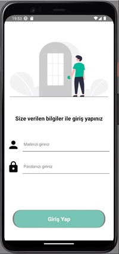

# GetWell Patient Tracking System





## Introduction

### Techs, Libs & Packages  🚀

- React Native
- React Navigation
- vector-icons
- Formik
- Firebase
- flash-messages
- Android Studio
- Node.js
- Vs Code

### Warning ⚡

Project content is in Turkish.

## Beginning

Clone this repository on your local machine.

```bash
git clone https://github.com/UmutOzcan/GetWell-Patient-Tracking-System
```

### Use

To use it after cloning the project:

```bash
cd ./HastaTakipApp
```

Run the following commands in the project folder to install the project dependencies.

```bash
npm init
npm install
```

These instructions will get a copy of the project up and running on your local machine for development and testing purposes.

## Available Scripts

In the project directory you can run:

```bash
npx react-native run-android
```

## For more information

You can learn more here: [React documentation](https://reactnative.dev/)
